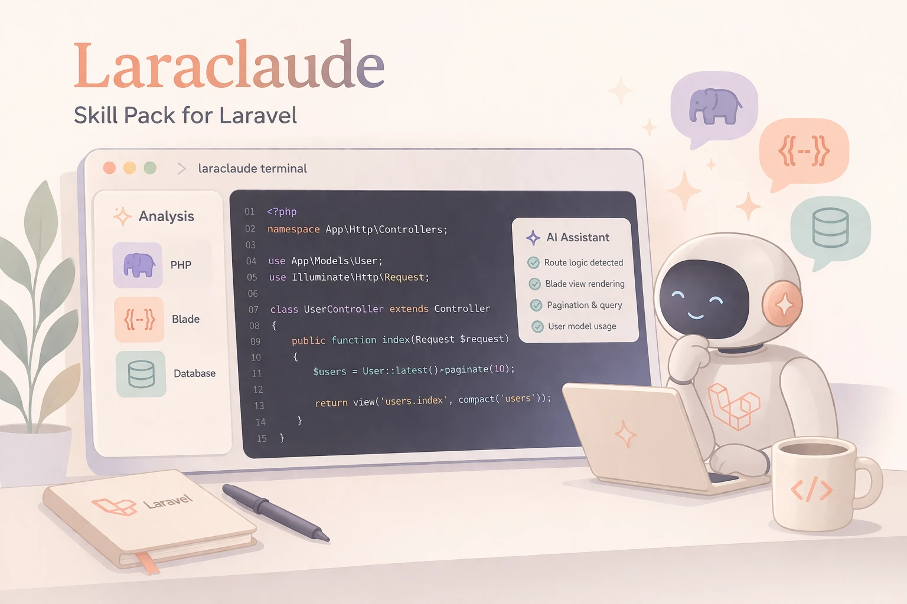

# LaraClaude

<p align="center">
  
</p>

A comprehensive Laravel toolkit plugin for [Claude Code](https://claude.ai/code). 27 specialized skills to analyze, debug, scaffold, and optimize Laravel applications directly from your terminal.

## Installation

```bash
/plugin install github:edulazaro/laraclaude
```

## Skills

### Database & Migrations

#### `/lc:consolidate-migrations`
Analyze and consolidate fragmented migration files. When your project accumulates hundreds of small migrations (add column, modify column, rename...), this skill merges them into clean, optimized files.

```
/lc:consolidate-migrations analyze        # Show consolidation report
/lc:consolidate-migrations properties     # Consolidate a specific table
/lc:consolidate-migrations all            # Consolidate all safe tables
```

**What it does:**
- Groups migrations by table
- Detects foreign key dependencies
- Classifies each as SAFE / CAUTION / DO NOT MERGE
- Merges ADD COLUMN into original CREATE
- Preserves data migrations
- Validates syntax after consolidation

#### `/lc:check-foreign-keys`
Detect broken, orphaned, or missing foreign key constraints across your migrations and models.

```
/lc:check-foreign-keys                    # Check all tables
/lc:check-foreign-keys properties         # Check specific table
```

**Detects:**
- FK in migration but no relationship in model
- Relationship in model but no FK in migration
- FK referencing non-existent tables or columns
- Risky `onDelete` actions

#### `/lc:migration-fresh-test`
Run `migrate:fresh` in your Docker container and get detailed error analysis with fix suggestions.

```
/lc:migration-fresh-test                  # Run migrate:fresh
/lc:migration-fresh-test --seed           # With seeders
```

---

### Models & Queries

#### `/lc:analyze-model`
Deep analysis of any Eloquent model — relationships, scopes, casts, fillable, observers, keepers, actions, and potential issues.

```
/lc:analyze-model Property                # Analyze specific model
/lc:analyze-model                         # List all models
```

**Shows:**
- All relationships with types and related models
- Scopes, accessors, mutators
- Casts, fillable, guarded
- Observers, Larakeep keepers, Laractions actions
- Potential issues (missing fillable, N+1 risks)

#### `/lc:find-n-plus-one`
Detect N+1 query problems in Blade views, Livewire components, and controllers.

```
/lc:find-n-plus-one                       # Scan entire project
/lc:find-n-plus-one resources/views/      # Scan specific directory
```

**Detects:**
- `$model->relationship` inside `@foreach` without eager loading
- Missing `with()` in Livewire computed properties
- Suggests the exact `with()` statement needed

#### `/lc:orphaned-records`
Find database records where the parent (foreign key) no longer exists.

```
/lc:orphaned-records                      # Check all tables
/lc:orphaned-records operations           # Check specific table
```

#### `/lc:unused-columns`
Detect database columns that are never referenced anywhere in the codebase.

```
/lc:unused-columns                        # Check all tables
/lc:unused-columns properties             # Check specific table
```

---

### Security & Performance

#### `/lc:security-audit`
Detect common Laravel security vulnerabilities — SQL injection, XSS, mass assignment, exposed secrets.

```
/lc:security-audit                        # Scan entire project
/lc:security-audit fix                    # Auto-fix with confirmation
/lc:security-audit fix --dry-run          # Preview fixes
/lc:security-audit app/Http/Controllers/  # Scan specific directory
```

#### `/lc:slow-queries`
Detect queries without indexes, queries in loops, and unbounded selects.

```
/lc:slow-queries                          # Scan entire project
/lc:slow-queries fix                      # Auto-fix with confirmation
/lc:slow-queries fix --dry-run            # Preview fixes
/lc:slow-queries app/Models/              # Scan specific directory
```

#### `/lc:cache-opportunities`
Detect repeated queries and computations that should be cached.

```
/lc:cache-opportunities                   # Scan entire project
/lc:cache-opportunities fix               # Auto-fix with confirmation
/lc:cache-opportunities fix --dry-run     # Preview fixes
/lc:cache-opportunities app/Services/     # Scan specific directory
```

---

### Livewire & Blade

#### `/lc:livewire-audit`
Detect common Livewire/Volt problems — unserializable properties, missing wire:key, orphaned events, re-render issues.

```
/lc:livewire-audit                        # Scan all components
/lc:livewire-audit fix                    # Auto-fix with confirmation
/lc:livewire-audit fix --dry-run          # Preview fixes
/lc:livewire-audit path/to/component.php  # Scan specific file
```

#### `/lc:livewire-optimize`
Detect and fix Livewire performance issues — heavy renders, excessive queries, unnecessary reactivity.

```
/lc:livewire-optimize                     # Scan all components
/lc:livewire-optimize fix                 # Auto-fix with confirmation
/lc:livewire-optimize fix --dry-run       # Preview fixes
/lc:livewire-optimize path/to/file.php    # Scan specific file
```

#### `/lc:blade-audit`
Detect hardcoded text without `@text()`, duplicate CSS classes, unused Blade components, and accessibility issues.

```
/lc:blade-audit                           # Scan all views
/lc:blade-audit fix                       # Auto-fix with confirmation
/lc:blade-audit fix --dry-run             # Preview fixes
/lc:blade-audit resources/views/livewire/ # Scan specific directory
```

---

### Scaffolding

#### `/lc:volt-component`
Generate a Livewire Volt single-file component following your project's conventions.

```
/lc:volt-component UserProfile            # Create component
```

**Generates:**
- PHP logic at top with `new class extends Component`
- Proper mount(), validation, form methods
- `@text()` translations with English defaults
- Single root element, proper wire:model bindings

#### `/lc:generate-action`
Create a Laractions action class with proper boilerplate and register it in the model.

```
/lc:generate-action Property/ToggleFeatured
```

#### `/lc:extract-action`
Extract business logic from a controller or Livewire component method into a Laractions Action class.

```
/lc:extract-action PropertyController:store    # Extract from controller method
/lc:extract-action path/to/file.php:methodName # Extract from any file
```

#### `/lc:generate-modal`
Generate a modal component using the project's `x-modal` pattern with Livewire integration.

```
/lc:generate-modal ConfirmDelete          # Create modal component
```

#### `/lc:generate-table`
Generate a table component with filters, sorting, and infinite scroll using the project's TableComponent base.

```
/lc:generate-table Property               # Create table for model
```

#### `/lc:generate-crud`
Generate complete CRUD scaffolding — migration, model, controller, routes, views (index + create/edit modal).

```
/lc:generate-crud Invoice                 # Full CRUD for Invoice
```

---

### Testing

#### `/lc:generate-test`
Generate feature/unit tests for a model, controller, action, or component by analyzing its code.

```
/lc:generate-test Property                # Generate tests for model
/lc:generate-test PropertyController      # Generate tests for controller
/lc:generate-test path/to/file.php        # Generate tests for any file
```

#### `/lc:test-coverage`
Analyze which models, controllers, and actions have tests and which don't.

```
/lc:test-coverage                         # Full coverage report
/lc:test-coverage app/Models/             # Check specific directory
```

---

### Code Quality

#### `/lc:dead-code`
Find unused classes, methods, routes, views, and imports.

```
/lc:dead-code                             # Scan entire project
/lc:dead-code clean                       # Remove dead code with confirmation
/lc:dead-code clean --dry-run             # Preview removals
/lc:dead-code app/Services/               # Scan specific directory
```

---

### Debug

#### `/lc:analyze-error`
Paste a Laravel stacktrace and get root cause analysis with a specific fix.

```
/lc:analyze-error
```

Then paste your error. The skill will:
- Parse the stacktrace
- Read the relevant source files
- Identify the root cause (not just the symptom)
- Provide a specific code fix

---

### Documentation

#### `/lc:api-docs`
Generate API documentation from routes, controllers, and form requests.

```
/lc:api-docs                              # Document all API routes
/lc:api-docs api/v1                       # Document specific route prefix
```

#### `/lc:model-diagram`
Generate an ER diagram of Eloquent models in Mermaid format.

```
/lc:model-diagram                         # All models
/lc:model-diagram Property                # Specific model and its relations
```

---

### DevOps

#### `/lc:docker-check`
Verify `docker-compose.yml`, `Dockerfile`, and `.env` are properly synchronized.

```
/lc:docker-check                          # Analyze configuration
/lc:docker-check fix                      # Fix .env mismatches
/lc:docker-check fix --dry-run            # Preview fixes
```

**Checks:**
- Database/Redis/Mail host matching service names
- Port conflicts between services
- PHP version consistency (Dockerfile vs composer.json)
- Required PHP extensions installed
- Volume path validity
- `.env` vs `.env.example` completeness

#### `/lc:deploy-checklist`
Verify the project is production-ready with a comprehensive checklist.

```
/lc:deploy-checklist                      # Run all checks
```

---

## Requirements

- [Claude Code](https://claude.ai/code)
- A Laravel project (8+, 9+, 10+, 11+, 12+, 13+)
- Docker (optional, for `migration-fresh-test` and `orphaned-records`)

## Contributing

Pull requests welcome. To add a new skill:

1. Create `skills/your-skill/SKILL.md`
2. Follow the YAML frontmatter format
3. Add to README
4. Submit PR

## License

MIT - see [LICENSE](LICENSE)
