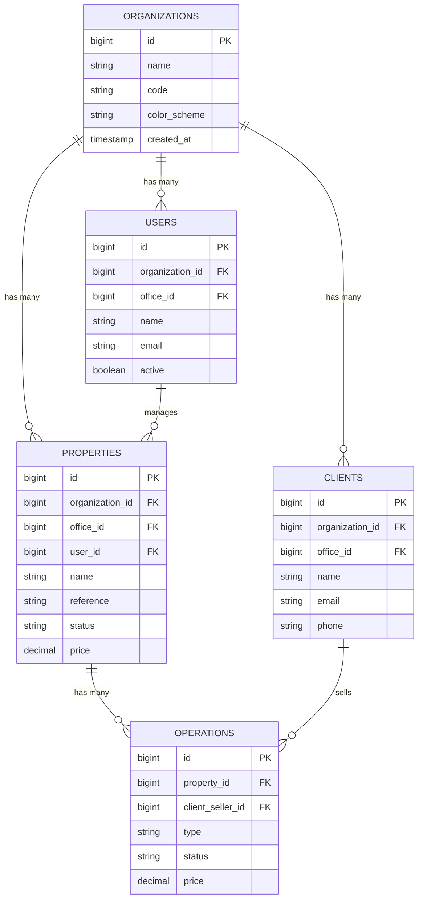
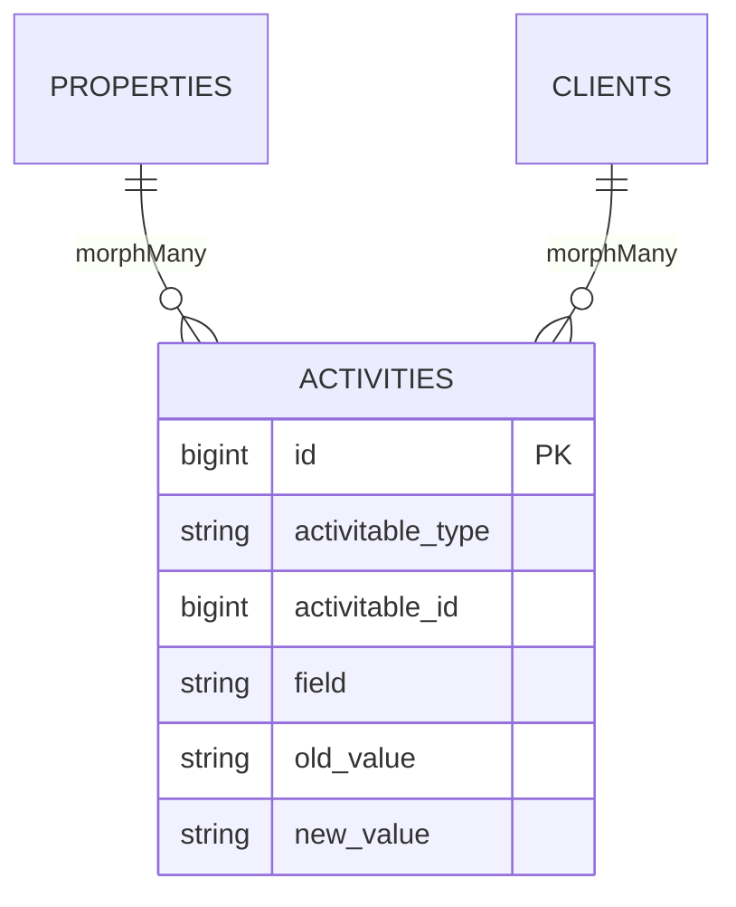

# Model Diagram

Generate an Entity-Relationship diagram of Eloquent models in Mermaid syntax. The output can be pasted into GitHub markdown, Notion, Mermaid Live Editor, or any tool that supports Mermaid diagrams.

## Subcommands

| Subcommand | Description |
|---|---|
| *(no argument)* | Generate an ER diagram of all models and their relationships. |
| `all` | Same as no argument -- diagram all models. |
| `[ModelName]` | Generate a focused diagram showing one model and its direct relationships (1 level deep). |

This is a generator skill -- it produces diagram output.

## Process

### Step 1: Collect All Models

1. Use `Glob` to find all `app/Models/*.php` files.
2. If a `[ModelName]` argument is provided, start with that model and include only directly related models.

### Step 2: Parse Each Model

For each model, use `Read` to extract:

#### A. Table Name
- From `$table` property or derive from class name (Laravel convention: `Property` -> `properties`)

#### B. Key Columns
Parse the corresponding migration to extract important columns:
- Primary key (id)
- Foreign key columns (*_id)
- Key business columns (name, title, status, type, email, etc.)
- Timestamps and soft deletes

Limit to the most important 8-12 columns per model to keep the diagram readable. Always include:
- Primary key
- All foreign keys
- Name/title columns
- Status/type columns

#### C. Relationships
Extract from model methods:
- `belongsTo` -> Many-to-one (FK on this model)
- `hasMany` -> One-to-many (FK on related model)
- `hasOne` -> One-to-one (FK on related model)
- `belongsToMany` -> Many-to-many (pivot table)
- `morphTo`, `morphMany`, `morphOne` -> Polymorphic
- `hasManyThrough`, `hasOneThrough` -> Through relationships

### Step 3: Generate Mermaid ER Diagram

Build the Mermaid `erDiagram` syntax:



### Relationship Notation

Use Mermaid ER diagram relationship types:

| Eloquent | Mermaid | Symbol | Meaning |
|----------|---------|--------|---------|
| `belongsTo` / `hasOne` | one-to-one | `\|\|--\|\|` | Exactly one to exactly one |
| `hasMany` | one-to-many | `\|\|--o{` | One to zero or more |
| `belongsToMany` | many-to-many | `}o--o{` | Zero or more to zero or more |
| `morphMany` | polymorphic | `\|\|--o{` | One to zero or more (labeled as polymorphic) |

### Step 4: Handle Large Codebases

For projects with many models (20+):

1. **Full diagram**: Include all models but limit columns to FK columns and 2-3 key business columns.
2. **Focused diagram**: When a `[ModelName]` is provided, show:
   - The target model with full column details
   - Direct relationships (1 level deep) with reduced columns
   - Relationship labels indicating the method name

### Step 5: Add Polymorphic Notes

Polymorphic relationships cannot be represented as standard ER relationships. Add notes:



Include a text note below the diagram:
```
Note: ACTIVITIES uses polymorphic relationships via activitable_type/activitable_id.
Types: property, client (see morph map in AppServiceProvider)
```

### Step 6: Output

Present the Mermaid diagram in a fenced code block:

````
```mermaid
erDiagram
    ...
```
````

Also provide:
1. Total models included
2. Total relationships mapped
3. Any models excluded (and why, e.g., pivot models without additional columns)
4. Notes about polymorphic relationships

If the diagram is very large, suggest splitting by domain area (e.g., Property domain, Client domain, Calendar domain).

## Notes

- Mermaid has rendering limits. Diagrams with 30+ entities may not render well. Suggest splitting in those cases.
- Pivot tables for `belongsToMany` are typically not shown as separate entities unless they have additional columns beyond the two FK columns.
- The diagram shows the logical data model, not the physical database schema. Some implementation details (indexes, constraints) are omitted for clarity.
- For the most accurate diagram, combine migration analysis (columns and types) with model analysis (relationships).
- If a model's table is not found in migrations (e.g., managed by a package), note it and include the model with just its relationships.
